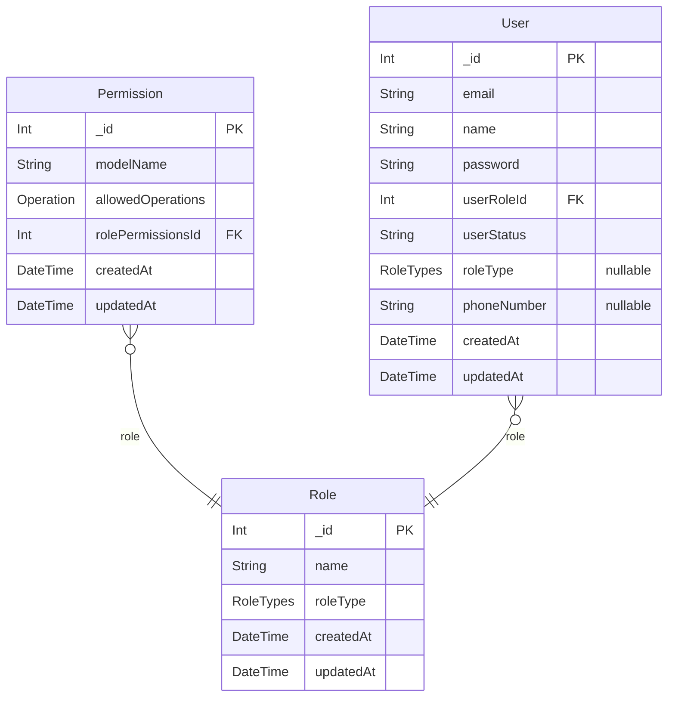

# Prisma ERD
> Generated by [`prisma-markdown`](https://github.com/samchon/prisma-markdown)

- [default](#default)

## default

### `Role`

**Properties**
  - `_id`: 
  - `name`: 
  - `roleType`: 
  - `createdAt`: 
  - `updatedAt`: 

### `Permission`

**Properties**
  - `_id`: 
  - `modelName`: 
  - `allowedOperations`: 
  - `rolePermissionsId`: 
  - `createdAt`: 
  - `updatedAt`: 

### `User`

**Properties**
  - `_id`: 
  - `email`: 
  - `name`: 
  - `password`: 
  - `userRoleId`: 
  - `userStatus`: 
  - `roleType`: 
  - `phoneNumber`: 
  - `createdAt`: 
  - `updatedAt`: 